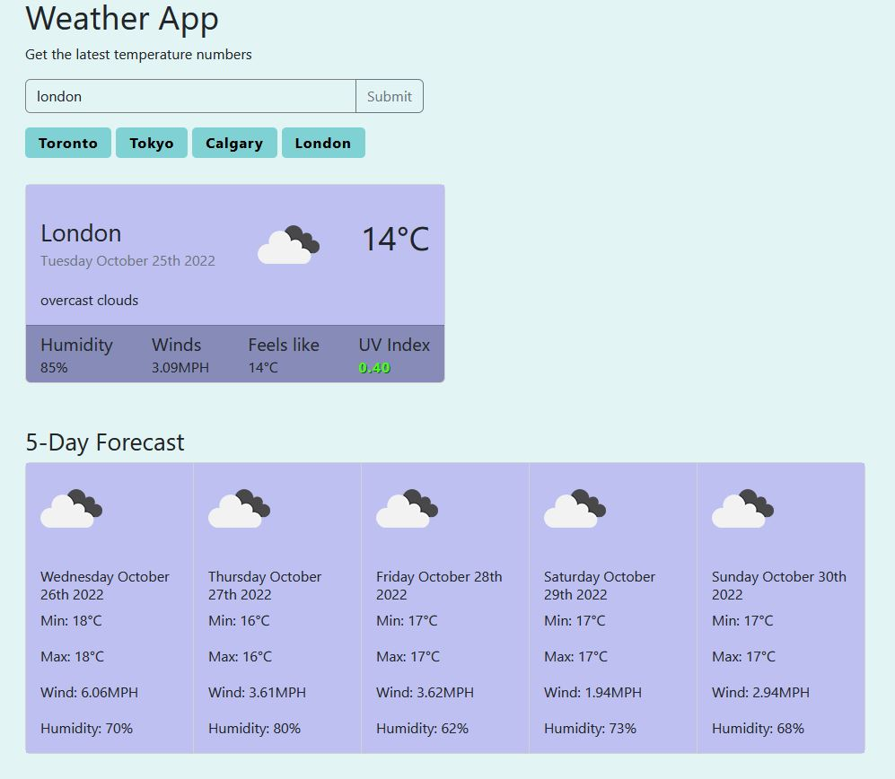

# Weather Forecast Dashboard (with API

## Links

- Live Site URL: [live site](https://jon-ledo.github.io/weather-forecast-app__API/)
- Repo: [repo](https://github.com/Jon-Ledo/weather-forecast-app__API)
- [link to openweathermap API, current day data](https://openweathermap.org/current)
- [link to openweathermap API, forecast data](https://openweathermap.org/forecast5)

## Preview

## Tech Used

- HTML
- CSS
- Bootstrap
- JavaScript
- 3rd party API's
  - openweathermap API (1day forecast): [link](https://openweathermap.org/current)
  - openweathermap API (5day forecast): [link](https://openweathermap.org/forecast5)
  - momentJS: [link](https://momentjs.com/)

## Description
